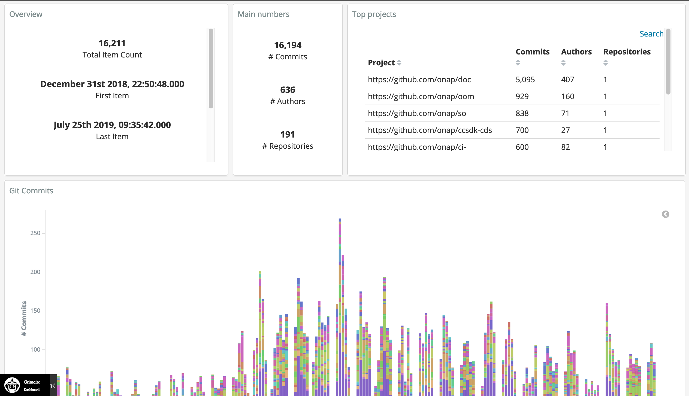

# GrimoireLab Cloud-Native

This project pretends to separate the [GrimoireLab components][1] in
microservices. This is an initial attempt to move it to Cloud-Native
architecture. The following table shows the current state of the
different components of this project:

| Component  | Version | Status         |
|------------|---------|----------------|
| Bestiary   |         | Non-Integrated |
| Kingarthur | 0.1.18  | Integrated     |
| Sigils     |         | Non-Integrated |
| Sirmordred | 0.2.25  | Integrated     |
| Sortinghat | 0.7.7   | Non-Integrated |

> Given that *sortinghat* isn't integrated yet it's not possible to
> use the panels provided by *sigils* so a custom panel has been
> created for displaying data.

The environment variables used by this project allows to modify the
workflow of the deployment process.

| Name                           | Default | Usage                                                  |
|--------------------------------|---------|--------------------------------------------------------|
| GRIMOIRELAB_DEBUG              | false   | Enables verbosity output during the deployment         |
| GRIMOIRELAB_DEPLOY_TAG         | stable  | Determine the Docker image tag to be pull or build it  |
| GRIMOIRELAB_DEPLOY_MODE        | pull    | Defines the method to fetch or build the Docker images |
| GRIMOIRELAB_NUM_ARTHUR_WORKERS | 10      | Number of Arthur Workers nodes that will be running    |

## Deployment

There are multiple ways to deploy this application. The scripts
of this project covers the installation of requirements of different
components. The quickest way to try this project is using its
[All-in-One bash script](all-in-one.sh) bash script.

    $ curl -fsSL https://raw.githubusercontent.com/electrocucaracha/grimoirelab/master/all-in-one.sh | GRIMOIRELAB_ORG=openstack bash

For more information, take a look of the [Deployment methods document](docs/src/deployment.rst).

## License

Apache-2.0

[1]: https://chaoss.github.io/grimoirelab-tutorial/basics/components.html#components
